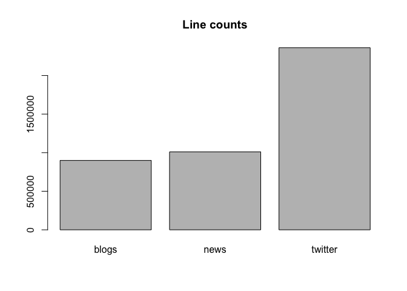

# Data Science Capstone: Milestone Report

## Synopsis

todo

## Loading training data

Download Training data from [Courcera site](https://d396qusza40orc.cloudfront.net/dsscapstone/dataset/Coursera-SwiftKey.zip). Files stored in zip archive, unzip it.

```r
loadData <- function () {
  if (!file.exists("./data/Coursera-SwiftKey.zip")) {
    dataUrl <- "https://d396qusza40orc.cloudfront.net/dsscapstone/dataset/Coursera-SwiftKey.zip"
    download.file(dataUrl, destfile = "./data/Coursera-SwiftKey.zip", method = "curl")
  }
  
  unzip("./data/Coursera-SwiftKey.zip", exdir = "./data");
}

if (!file.exists("./data")) {
  dir.create("./data")
}

if (!file.exists("./data/final")) {
  loadData()
}
```

There are 4 folders after unzipping.

```r
list.files("./data/final")
```

```
## [1] "de_DE" "en_US" "fi_FI" "ru_RU"
```

Each folder contains 3 files for specific language.

```r
list.files("./data/final/en_US")
```

```
## [1] "en_US.blogs.txt"   "en_US.news.txt"    "en_US.twitter.txt"
```

## Files analysis

We will use english files for analysis. First we read the files.

```r
readFiles <- function () {
  files <- c()
  paths <- c(
    "blogs"   = "./data/final/en_US/en_US.blogs.txt",
    "news"    = "./data/final/en_US/en_US.news.txt",
    "twitter" ="./data/final/en_US/en_US.twitter.txt"
  )
  
  for (name in names(paths)) {
    files[[name]] <- readLines(paths[name], encoding = "UTF-8", skipNul = TRUE)
  }
  
  return(files)
}

if (!exists("files")) {
  files <- readFiles()
}
```

Calculating word and line counts.

```r
library(stringi)

getFileStats <- function () {
  files_stat <- NULL
  
  for (name in names(files)) {
    file <- files[[name]]
    stats <- stri_stats_general(file)
    data <- data.frame(t(stats), row.names = name)
    data$Words <- sum(stri_count_words(file))

    if (is.null(files_stat)) {
      files_stat <- data
    } else {
      files_stat <- rbind(files_stat, data)
    }
  }
  
  return(files_stat)
}

files_stat <- getFileStats()
files_stat
```

```
##           Lines LinesNEmpty     Chars CharsNWhite    Words
## blogs    899288      899288 206824382   170389539 37546246
## news    1010242     1010242 203223154   169860866 34762395
## twitter 2360148     2360148 162096241   134082806 30093410
```

Plotting graphs.

```r
barplot(files_stat[, "Lines"], names.arg = row.names(files_stat), main = "Line counts")
```

 

```r
barplot(files_stat[, "Words"], names.arg = row.names(files_stat), main = "Word counts")
```

 

## Bigram and Trigram analysis

todo

## Plans

todo
