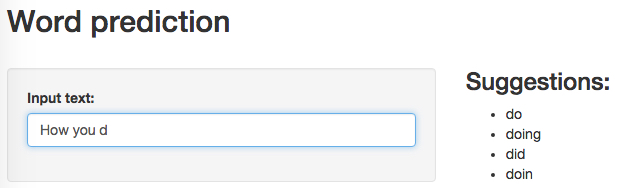

Word prediction app. Data science capstone project.
========================================================
author: Evgeny Ivanov
date: Sat Aug 15 08:53:35 2015

It's SIMPLE
========================================================

Just type phrase in textbox and get suggestions.



It's ACCURATE
========================================================

Prediction based on N-grams obtained from twitter, news and blogs texts.

Cleared:

```r
corpus <- Corpus(VectorSource(data))
corpus <- tm_map(corpus, removePunctuation)
corpus <- tm_map(corpus, removeNumbers)
corpus <- tm_map(corpus, tolower)
corpus <- tm_map(corpus, stripWhitespace)
```

And tokenized:

```r
tokens <- NGramTokenizer(corpus$content, Weka_control(min = tokenNum, max = tokenNum, delimiters = " \\r\\n\\t.!?,;\"()"))
```

It's FAST
========================================================

Obtained tokens stored in SQLite Database. With help of SQLite INDEX feature we can find tokens very fast (faster than 1 sec):


```r
library("RSQLite")
con <- dbConnect(SQLite(), dbname = "./app/dictionary.sqlite")

findSentence <- function (sentence, num = 1, limit = 25) {
  dbGetQuery(con, paste("SELECT * FROM tokens", num, " WHERE token LIKE '", sentence, "%' ORDER BY num DESC LIMIT ", limit, sep = ""))
}
```

Try it NOW
========================================================

App is deployed to shinyapps.io and you can check it now! Just go to the following url:

https://tyz910.shinyapps.io/predict
